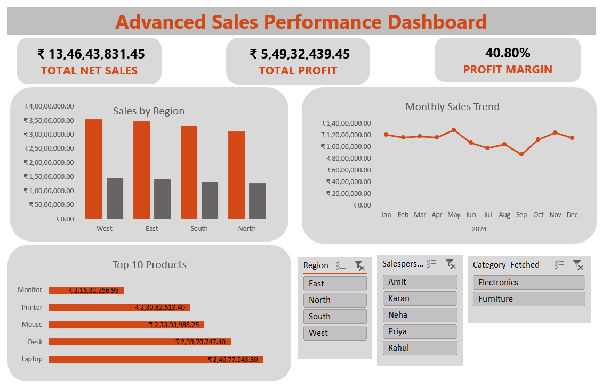

# Advanced Excel Sales Performance Dashboard

## 📌 Project Overview
This project demonstrates advanced Excel skills through an end-to-end sales analysis workflow.  
Raw transactional data was cleaned, transformed, and analyzed to build an interactive dashboard for business decision-making.

The objective of this project is to analyze sales performance, profitability, and trends across regions, products, and salespersons using Microsoft Excel.

---

## 🛠 Tools & Techniques Used
- Microsoft Excel
- Advanced Excel formulas:
  - XLOOKUP
  - INDEX & MATCH
  - IF / IFERROR
  - NULL handling logic
- Data cleaning and standardization
- Pivot Tables and Pivot Charts
- Conditional Formatting
- Interactive Slicers
- KPI-based dashboard design

---

## 📊 Key Features
- Total Net Sales, Total Profit, and Profit Margin KPIs
- Sales and profitability analysis by region
- Monthly sales trend analysis
- Top 10 products by net sales
- Salesperson performance analysis
- Interactive filtering using slicers (Region, Category, Salesperson)

---

## 🧠 Business Insights
- Identified high-performing and low-performing regions
- Analyzed seasonal sales trends across months
- Highlighted top revenue-generating products
- Compared profitability across salespersons and regions

---

## 🖼 Dashboard Preview

---

## 📂 Repository Structure
- `Advanced_Excel_Sales_Project.xlsx`  
  Complete Excel file containing raw data, cleaned data, calculations, pivot tables, and the final dashboard.

- `raw_data.xlsx`  
  Original raw dataset provided separately to demonstrate the data cleaning and transformation process.

- `dashboard_preview.png`  
  Screenshot of the final interactive Excel dashboard.

- `README.md`  
  Project documentation.

---

## 📈 Skills Demonstrated
- Advanced Excel data analysis
- Data cleaning and validation
- Business-oriented KPI reporting
- Dashboard design and storytelling
- Analytical thinking and structured workflow

---

## 📎 Notes
- Raw data has been preserved separately to maintain data integrity.
- All KPIs and charts in the dashboard are driven by Pivot Tables and update dynamically with slicer selections.

---

## 👤 Author
Anjali Kumari
